# Verity Google Cloud Console Inspection Guide

- **Prepared:** 2026-08-27
- **Project:** `verity-506800`
- **Region:** `us-central1`
- **Expected account:** `ziyadazzazdesigner@gmail.com`
- **Purpose:** inspect the sandbox-probe state and cost without changing anything

This is the visual companion to
[WORKLOG-2026-08-27-CLOUD-SANDBOX-PREPARATION.md](WORKLOG-2026-08-27-CLOUD-SANDBOX-PREPARATION.md).
The worklog explains what was done, what failed, why each decision was made, test evidence, cost,
professional assessment, and the next approval gate. This guide shows exactly where to see the
same facts in Google Cloud Console.

## Critical safety rule

This is a **read-only inspection**. Do not click any control that creates, edits, executes,
publishes, grants, deletes, or changes financial configuration.

In particular, do **not** click:

- **Execute**, **Execute job**, **Deploy**, **Edit**, or **Delete** in Cloud Run;
- **Grant access**, **Edit principal**, or **Add role** in IAM;
- **Add new version**, **View secret value**, **Disable**, or **Destroy** in Secret Manager;
- **Publish message**, **Create subscription**, or **Delete topic** in Pub/Sub;
- **Run trigger**, **Rebuild**, or **Retry** in Cloud Build;
- **Budgets & alerts**, **Payment settings**, **Account management**, **Manage payment methods**,
  **Upgrade**, **Quota**, or any financial edit control.

If the Console displays an unexpected resource, nonzero sandbox IAM role, job execution, public
access, cost above `$0.05` for the recorded attempts, or the wrong project/account, stop and send
the details before changing anything.

## What the probe has done so far

```mermaid
flowchart LR
    S[Clean Git revision 1b0ff95] --> B[Default-pool Cloud Build<br/>81.533 seconds]
    B --> I[Immutable sandbox image<br/>SHA-256 digest]
    I --> J[Private verity-sandbox Job<br/>no-role service account]
    J --> P[Execution verity-sandbox-rcxvn<br/>metadata token obtained]
    P --> D[Six sensitive APIs<br/>all denied 403]
    D --> F[Least-privilege proof passed]
    F -. owner review required .-> N[Prepared production plan<br/>not executed]
```



The solid path is complete. The dotted production step has **not run**. The Console must currently
show two successful Cloud Run executions; the latest structured stdout report and validator JSON
contain six explicit 403 denials and `passed: true`.

## Step 1 — Confirm the account and project

1. Open the [Google Cloud project dashboard](https://console.cloud.google.com/home/dashboard?project=verity-506800).
2. Look at the account avatar in the top-right corner.
3. Confirm the signed-in account is `ziyadazzazdesigner@gmail.com`.
4. Look at the project selector in the top bar.
5. Confirm it says project ID `verity-506800`, not merely a similar display name.

Expected result:

- account: `ziyadazzazdesigner@gmail.com`;
- project ID: `verity-506800`; and
- project status: active.

Stop if either the account or project differs.

## Step 2 — Inspect actual Billing Reports safely

1. With `verity-506800` still selected, open
   [Cloud Billing](https://console.cloud.google.com/billing?project=verity-506800).
2. If Google asks which billing account to view, select the account linked to this project. Do not
   copy its identifier into public documentation.
3. In the left menu, choose **Reports**. Do not open or edit **Budgets & alerts**.
4. Set **Time range** to **Current month** or a custom range beginning `2026-08-27`.
5. Set the **Projects** filter to only `verity-506800`.
6. Set **Group by** to **Service**.
7. Record the values shown for:
   - total cost before credits;
   - credits/discounts;
   - net cost; and
   - the report's latest data timestamp.
8. If any cost appears, also group by **SKU** and record which SKU produced it.

Billing data can be delayed. If the report says `$0.00`, also record the latest data timestamp so
we know whether the build time is covered. If it shows no new data yet, report **not posted yet**,
not `$0.00 confirmed`.

Expected measured usage before billing discounts:

- cumulative Cloud Build and Cloud Run raw list-price equivalent: approximately `$0.029848`;
- Artifact Registry: 444.338 MB, below the first 0.5 GiB-month free allowance;
- Secret Manager: three active versions, below the first six-version allowance;
- Pub/Sub: zero throughput;
- latest Cloud Run execution: 89.433 seconds, approximately `$0.003935` before free tier; and
- conservative cumulative raw upper bound: less than `$0.03` plus negligible storage.

Official reference: [Google Cloud Billing Reports documentation](https://docs.cloud.google.com/billing/docs/how-to/reports).

## Step 3 — Inspect the successful Cloud Build

1. Open [Cloud Build history](https://console.cloud.google.com/cloud-build/builds?project=verity-506800).
2. Find the latest build ID `9e9ee62b-552c-428a-a983-0dcd0a3570b0`.
3. Open it and verify:
   - status: **Success**;
   - start: `2026-08-27 09:52:06 UTC` approximately;
   - finish: `2026-08-27 09:53:28 UTC` approximately;
   - duration: approximately **1 minute 22 seconds**;
   - image tag ends in `verity-sandbox:1b0ff95c74d0`; and
   - no private worker-pool name is shown.
4. You may read the build log. Do not click **Rebuild**, **Retry**, or create a trigger.

The two earlier successful builds should also remain visible.
Cloud Build IDs and durations are the primary evidence used for the cost calculation.

## Step 4 — Inspect the immutable Artifact Registry image

1. Open [Artifact Registry](https://console.cloud.google.com/artifacts?project=verity-506800).
2. Select region `us-central1` if the page asks for a location.
3. Open repository `verity`.
4. Open package/image `verity-sandbox`.
5. Verify the latest revision tag is `1b0ff95c74d0`.
6. Verify the digest is exactly:

   ```text
   sha256:615e71df55395e0ec84e875bf943bda22d6e84d62d95835a59965cc7c12853b3
   ```

7. Confirm repository size is approximately **444.338 MB**.

Do not delete the image or change cleanup policies. The digest is important because a SHA-256
digest cannot silently move to a different container image the way a mutable tag can.

## Step 5 — Inspect the private Cloud Run Job

1. Open [Cloud Run Jobs](https://console.cloud.google.com/run/jobs?project=verity-506800).
2. Set region to `us-central1`.
3. Open job `verity-sandbox`.
4. On the job details/configuration tabs, confirm:
   - service account:
     `verity-sandbox@verity-506800.iam.gserviceaccount.com`;
   - image uses the exact SHA-256 digest from Step 4;
   - CPU: `2`;
   - memory: `4 GiB`;
   - task timeout: `3600 seconds`;
   - maximum retries: `0`;
   - environment variables: none;
   - secrets: none;
   - volumes and volume mounts: none; and
   - VPC/network attachment: none.
5. Open **Executions** or the execution-history section.
6. Confirm it contains two executions. The latest is `verity-sandbox-rcxvn`; the earlier one is
   `verity-sandbox-fmg7n`.
7. Open `verity-sandbox-rcxvn` read-only and confirm:
   - status: successful;
   - one succeeded task;
   - duration: approximately **1m29.43s**;
   - image digest matches Step 4; and
   - arguments are `--verify-identity verity-506800:us-central1`.
8. Open its **Logs** tab and locate the line beginning
   `VERITY_SANDBOX_IDENTITY_V1=`. It should show six status codes of 403, including Firestore.

Do not click **Execute**. The next execution must be launched only by the reviewed validator after
explicit approval. Google documents that a job execution starts container resources and appears
in the execution list: [Cloud Run execution documentation](https://docs.cloud.google.com/run/docs/managing/job-executions).

## Step 6 — Confirm the sandbox identity has no project role

1. Open [Service Accounts](https://console.cloud.google.com/iam-admin/serviceaccounts?project=verity-506800).
2. Confirm the account
   `verity-sandbox@verity-506800.iam.gserviceaccount.com` exists.
3. Open [IAM](https://console.cloud.google.com/iam-admin/iam?project=verity-506800).
4. Use the filter field to search for the full sandbox service-account email.
5. Expected result: no direct project-level role is granted to this principal. Depending on the
   Console view, that can appear as no IAM row at all because principals with zero grants are not
   listed in the project policy.
6. If any role appears—especially Owner, Editor, Viewer, Cloud Run, Storage, Secret Manager,
   Pub/Sub, Vertex AI, or Firestore roles—stop and send the role name. Do not remove it yourself.

The command-line evidence also found zero resource-level IAM policies referencing this identity.
The Console project IAM view is a human-readable cross-check, not a replacement for the project
and resource-policy searches already recorded.

## Step 7 — Inspect Firestore

1. Open [Firestore databases](https://console.cloud.google.com/firestore/databases?project=verity-506800).
2. Confirm database `(default)` exists.
3. Confirm edition Standard, mode Firestore Native, and location `us-central1`.
4. Confirm there is no document at the probe's forbidden path; its write was denied.

Do not create another database, change location-related settings, or enable paid backup/PITR
features during inspection.

## Step 8 — Inspect the non-sensitive Secret Manager sentinel

1. Open [Secret Manager](https://console.cloud.google.com/security/secret-manager?project=verity-506800).
2. Open `verity-sandbox-deny-probe`.
3. Confirm there are exactly three enabled versions: versions `1`, `2`, and `3`.
4. Confirm automatic replication is used.

Do not view the value and do not add, disable, or destroy a version. The value is deliberately
non-sensitive, but inspecting it is unnecessary. Its purpose is only to prove later that the
sandbox token cannot read Secret Manager.

## Step 9 — Inspect the Pub/Sub sentinel topic

1. Open [Pub/Sub Topics](https://console.cloud.google.com/cloudpubsub/topic/list?project=verity-506800).
2. Open topic `verification-jobs`.
3. Confirm the full name is
   `projects/verity-506800/topics/verification-jobs`.
4. Confirm there is no production push subscription created by this probe.

Do not publish a message or create a subscription. The topic exists only so the sandbox token can
later attempt—and be denied—a real publish request.

## Step 10 — Inspect enabled APIs

1. Open the [APIs & Services dashboard](https://console.cloud.google.com/apis/dashboard?project=verity-506800).
2. Confirm the expected APIs are enabled, including Cloud Run, Cloud Build, Artifact Registry,
   Secret Manager, Pub/Sub, Firestore, Vertex AI, Cloud Storage, Cloud Asset, and Logging.

API enablement alone does not prove the API was used and does not prove the security check passed.
Do not enable additional APIs, change quota, or request quota increases.

## Step 11 — Optional Cloud Build source-storage check

1. Open [Cloud Storage browser](https://console.cloud.google.com/storage/browser?project=verity-506800).
2. Open bucket `verity-506800_cloudbuild` if it is visible.
3. Open folder `source/`.
4. The recorded source object is:

   ```text
   1787824311.107904-dc58aa578ba24ff5aff91983d4e7f783.tgz
   ```

5. Its recorded size is **2,532,894 bytes**.

Do not delete it or change the bucket lifecycle during this inspection.

## Expected-state checklist

- [ ] Correct account and project are selected.
- [ ] Billing report is filtered only to `verity-506800` and its latest-data time is recorded.
- [ ] Build `9e9ee62b-552c-428a-a983-0dcd0a3570b0` shows Success and about 82 seconds.
- [ ] Repository `verity` contains the expected immutable sandbox digest.
- [ ] `verity-sandbox` Job is private and has exactly two successful executions.
- [ ] Latest execution `verity-sandbox-rcxvn` shows six 403 denials and `passed: true`.
- [ ] Sandbox service account exists with no project IAM role.
- [ ] Firestore `(default)` is Standard Native in `us-central1`.
- [ ] Sentinel secret has exactly three active versions.
- [ ] Sentinel Pub/Sub topic exists without a production push subscription.
- [ ] No Verity API, pipeline worker, or public production service exists.
- [ ] No setting was edited during inspection.

## Send these details back

Copy this template into your reply and fill in only what the Console visibly shows. Screenshots are
also useful, but hide billing-account IDs or unrelated project information.

```text
Project shown: verity-506800 / different
Billing report time range:
Billing latest-data timestamp:
Cost before credits:
Credits/discounts:
Net cost:
Services or SKUs with nonzero cost:
Cloud Build status and duration:
Artifact digest matches: yes/no
Cloud Run execution count:
Sandbox IAM roles shown:
Secret versions shown:
Pub/Sub subscriptions shown:
Anything unexpected:
```

## Professional assessment and what happens next

The current Console state should show a correctly built, digest-pinned, no-role sandbox job with
two successful executions. The latest execution is the complete security proof: validator-produced
JSON contains six explicit 403 denials and is bound to the expected identity and immutable digest.

After you inspect the pages and send the Billing/Console details, the recommended next step is to
review [POST-PROBE-PRODUCTION-DEPLOYMENT-PLAN.md](POST-PROBE-PRODUCTION-DEPLOYMENT-PLAN.md).
Production remains closed until you explicitly approve that plan. The first implementation steps
will resolve package installation, install and validate deployment tooling, update guard tests,
and rerun all local gates before any privileged cloud resource is created.

## Documentation record

This guide was added because the technical worklog alone did not provide a simple visual Console
walkthrough. It adds no cloud resources and performs no cloud or billing mutation. Its design
intentionally separates inspection from action so a reviewer cannot accidentally turn evidence
collection into an unapproved deployment, IAM change, job execution, or financial change.
