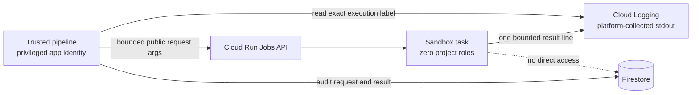

# Verity Scoped Cloud Security Fix

**Implemented:** 2026-08-25

**Status:** locally implemented and tested; live Google Cloud acceptance test pending

## Decision

The 2026-08-24 audit correctly blocked the original Cloud Run sandbox. That task read and wrote
Firestore while arbitrary repository code ran under the same Firestore-capable service identity.
Because Cloud Run exposes the task identity through its metadata server, untrusted code could
obtain a real access token and use the sandbox's project permissions.

For the hackathon deadline, Verity now uses a smaller design that closes that credential path
without building a custom capability broker:

1. The trusted pipeline serializes a bounded `SandboxRequest` into Cloud Run execution arguments.
2. The sandbox task runs with a dedicated service account that has **zero project or discovered
   resource-level IAM bindings**.
3. The sandbox image contains no Firestore or other Google Cloud client and receives no Verity,
   Gemini, GitHub, Pub/Sub, or service-account secret.
4. The sandbox supervisor emits one bounded `EnvironmentResult` envelope to stdout.
5. Cloud Run collects stdout as a platform function; the sandbox identity needs no Logging role.
6. The trusted pipeline reads only the exact execution's labeled stdout entry and persists the
   result to Firestore itself.



## What changed

| Area | Before | Now |
|---|---|---|
| Request handoff | Sandbox read `sandbox_runs` from Firestore | Bounded compressed execution arguments |
| Result handoff | Sandbox wrote `sandbox_runs` to Firestore | Platform-collected stdout, read by trusted pipeline |
| Sandbox IAM | `roles/datastore.user` | No project/resource binding found; deployment fails if one exists |
| Sandbox dependencies | Pydantic plus Firestore client stack | Pydantic only |
| Sandbox environment | Project identifier configured | Deployment clears user-defined environment variables |
| Live security proof | None | Metadata-token abuse probe is a mandatory deployment gate |
| Pub/Sub authentication | OIDC requested but URL secret checked | Google OIDC signature/audience plus exact service-account email |
| Job execution role | Broad Cloud Run Developer | Cloud Run Jobs Executor With Overrides on the individual jobs |
| Deployment failures | Native command failures could be missed | Every external command is checked; partial success cannot print as success |
| Secret upload | PowerShell pipeline could append a newline | Exact UTF-8 bytes written through a temporary file |
| Container build context | Relied on implicit ignore behavior | Explicit Docker/Cloud Build ignores exclude env files, credentials, databases, caches, and Git metadata |
| Cloud image reference | Commit-shaped tag remained mutable | Artifact Registry tag is resolved and deployed as an exact validated SHA-256 digest |

The main implementation is in:

- [`verity/cloud_handoff.py`](../verity/cloud_handoff.py)
- [`verity/sandbox_runner.py`](../verity/sandbox_runner.py)
- [`verity/agents/environment.py`](../verity/agents/environment.py)
- [`verity/identity_probe.py`](../verity/identity_probe.py)
- [`scripts/validate_cloud_sandbox_identity.py`](../scripts/validate_cloud_sandbox_identity.py)
- [`scripts/deploy_sandbox_probe.ps1`](../scripts/deploy_sandbox_probe.ps1)
- [`scripts/deploy.ps1`](../scripts/deploy.ps1)

## Bounded handoff rules

- Requests are strict typed models, compressed, base64 encoded, limited to 96,000 encoded
  characters, split into ordered 24,000-character arguments, and rejected if chunks are missing,
  duplicated, reordered, foreign, malformed, or oversized.
- Results are strict typed envelopes bound to the random run ID.
- stdout, stderr, evidence, and diagnostic files are compacted until the entire result remains
  below 160,000 encoded characters, safely below Cloud Logging's entry limit.
- Decompression is capped at 1 MiB to reject compressed payload bombs.
- Source and repository URL queries are stripped before serialization, and repository URLs are
  revalidated against the configured host allowlist, so an unnecessary query token cannot cross
  the sandbox boundary through argv.
- A missing, malformed, mismatched, oversized, or delayed result becomes an infrastructure
  failure. It never becomes a claim verdict.
- The sandbox request contains public-source execution data, not an authorization capability.

## Mandatory live identity test

The production deployment blueprint creates `verity-sandbox@PROJECT.iam.gserviceaccount.com`,
removes the legacy Firestore binding if present, and fails if any project binding remains. It also
uses Cloud Asset Inventory to search every accessible IAM policy in the project scope for a
resource-level binding to that identity and fails if one is found. A separate proof script exists
so the owner can collect the required evidence without opening either production guard or
deploying the privileged application:

```powershell
powershell -File scripts/deploy_sandbox_probe.ps1 `
  -ProjectId YOUR_PROJECT_ID `
  -Region us-central1
```

The proof script requires a clean committed tree, verifies billing and authentication, builds only
`Dockerfile.sandbox`, creates non-sensitive Secret Manager and Pub/Sub sentinels, deploys only the
no-role sandbox job, and invokes `validate_cloud_sandbox_identity.py`. It does not deploy the API,
pipeline worker, GitHub token, Gemini key, Pub/Sub subscription, or any public service.

The probe deliberately:

1. obtains the metadata service account email;
2. steals the metadata access token;
3. attempts a Firestore document write, Secret Manager version read, Pub/Sub publish, Cloud Run
   job execution, Vertex AI model listing, and Cloud Storage bucket listing; and
4. accepts only explicit HTTP `401` or `403` denials from every API.

Before launching the probe, the validator also requires the exact sandbox service account and
expected image, requires exactly one container using the image's default entrypoint, and rejects
**every** user-defined environment variable, secret, volume, volume mount, or VPC attachment in
the deployed job spec. Deployment explicitly clears all of those ambient capabilities.

A network timeout, missing API, unexpected identity, `404`, or successful response is
inconclusive or unsafe and fails deployment. The token itself is never printed or persisted.

## Pub/Sub OIDC correction

The push endpoint no longer accepts a secret in its URL. Production requires:

- `VERITY_PUBSUB_OIDC_AUDIENCE`, matched cryptographically against the token audience; and
- `VERITY_PUBSUB_SERVICE_ACCOUNT`, matched exactly against a verified email claim.

Google's signature and issuer validation run before the message is decoded or a pipeline job is
launched. Certificate-transport failure returns a retryable service error; invalid identity
returns an authentication error.

## Local verification

Focused tests cover:

- typed request/result round trips and run-ID binding;
- malformed, foreign, missing, and reordered request chunks;
- result compaction below the logging limit;
- Cloud Run overrides containing request arguments and **no environment variables**;
- a sandbox runner with no settings, Firestore, or Google Cloud client import;
- identity reports that pass only on explicit authorization denial;
- rejection of malicious project/region endpoint components;
- OIDC audience, bearer syntax, verified email, and exact identity checks;
- deployment ordering, no-role assertions, cleared environment, narrow job executor role, and
  removal of query-string secrets; and
- PowerShell deployment-script syntax.

The complete local gates pass: Ruff, format, strict mypy, `pip check`, 262 non-Docker tests, 9
real-Docker tests, the minimal sandbox image/dependency inspection, and all 8 Docker isolation
attacks. Exact evidence and the externally blocked catalogue status are recorded in
[SCOPED-SECURITY-VALIDATION-2026-08-25.md](SCOPED-SECURITY-VALIDATION-2026-08-25.md).

## Honest residual-risk assessment

**No: a no-role sandbox identity is not, by itself, sufficient to make arbitrary untrusted
repositories completely safe.** It closes the audit's critical project-credential path and makes
a stolen metadata token useless against the tested Google APIs. It does not eliminate every
container, network, availability, or evidence-integrity risk.

Remaining limitations:

- Cloud Run does not reproduce the local runner's separate networked preparation and offline
  evaluation phases. Repository clone, dependency build hooks, and evaluation still share the
  task's outbound network policy.
- A malicious dependency can scan public/private reachable networks, attack third-party systems,
  consume the task's CPU/memory/disk, or exploit an unknown runtime/kernel vulnerability.
- The metadata identity may receive inherited organization/folder permissions or future grants.
  The direct-policy assertion cannot prove otherwise; the live API-denial probe is therefore
  mandatory and must be repeated after IAM changes.
- The stdout result channel is bounded and execution-scoped, but it is not cryptographic evidence
  that a malicious benchmark reported a truthful number. Verity verifies reproducibility of
  ordinary public claims; it is not a hostile-code attestation platform.
- Dataset, checkpoint, hardware, dependency graph, precision, and source-byte provenance are not
  yet cryptographically bound to the verdict beyond repository commit pinning.
- A crashed worker can remain stranded because leases, heartbeats, and a recovery sweep are
  deferred. Queue republishing exists, but there is no transactional delivery outbox.
- DNS-rebinding TOCTOU, install-time LAN exposure, Firestore's 1 MiB document limit, and the local
  runner's mutable image tag remain documented hardening work. Cloud deployment images are now
  digest-pinned.

For a time-bounded hackathon deployment, the scoped design is defensible only when the live
identity probe passes, the project contains no sensitive private network reachable by the task,
the service is rate- and budget-controlled, and the submission describes these limitations
plainly. A production service for arbitrary hostile repositories still needs stronger egress,
process, artifact, provenance, and recovery controls.

## Remaining gate

Both fail-closed production guards remain active until the owner provides a Google Cloud project
ID, confirms billing/credits, authenticates `gcloud` locally, and approves the sandbox-only proof.
Agents CLI is needed later for the application deployment, not for this proof. After the test
produces real denial evidence, guard removal should be a small, reviewable change followed
immediately by staging deployment and one previously unseen end-to-end claim.
