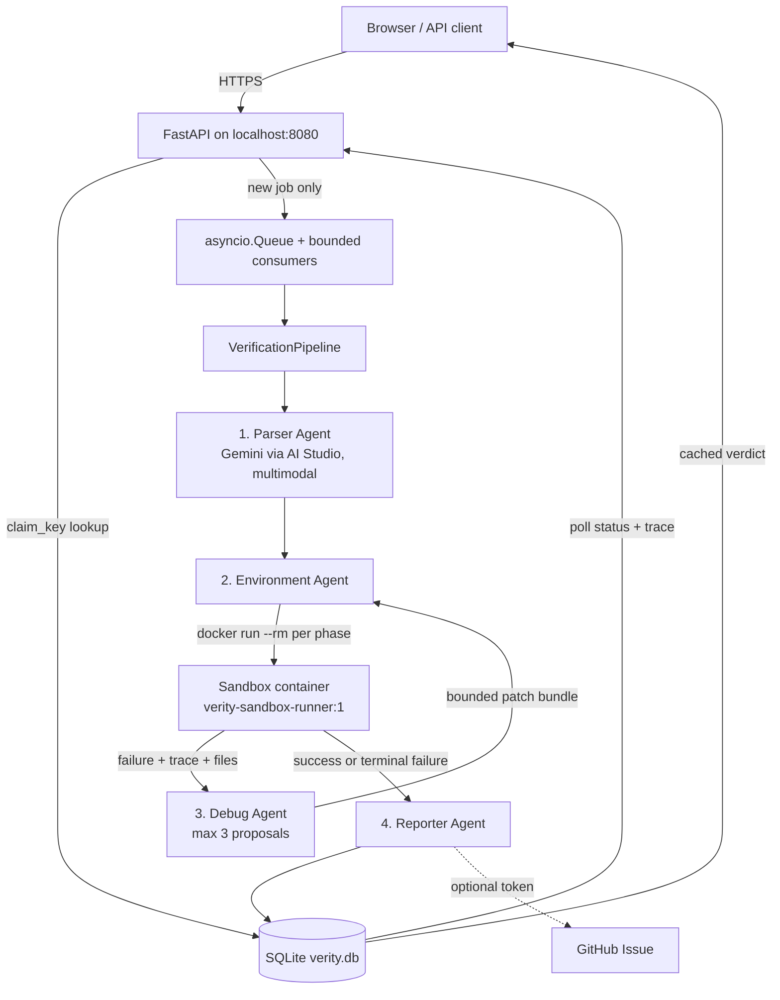
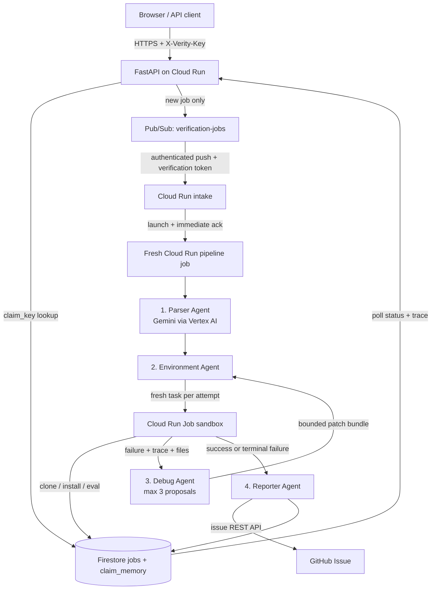

# Verity architecture

Verity runs the same four agents over two interchangeable infrastructures. `VERITY_ENV`
picks one; nothing else in the codebase branches on it.

| Seam | Interface | `VERITY_ENV=local` | `VERITY_ENV=cloud` |
|---|---|---|---|
| State + trace + claim memory | `JobStore` | `SQLiteJobStore` (`verity.db`) | `FirestoreJobStore` |
| Intake → processing | `JobQueue` | `AsyncioJobQueue` | `PubSubJobQueue` |
| Model calls | `ModelClient` | `GeminiAIStudioClient` (API key) | `VertexAIModelClient` |
| Untrusted execution | `SandboxBackend` | `DockerSandboxBackend` | `CloudRunJobBackend` |

The interfaces live in [`verity/interfaces.py`](../verity/interfaces.py) and the selection
lives in [`verity/container.py`](../verity/container.py) — the only module that imports a
concrete backend. No agent, no pipeline step, and no test touches SQLite, Docker,
Firestore, Pub/Sub, or Cloud Run directly.

## Local pipeline

## Cloud pipeline

The two diagrams differ only in the boxes the table above names. The agent graph, the
typed contracts in `verity/models.py`, and the three-attempt cap are identical.

## The sandbox

The Environment Agent executes arbitrary third-party code from GitHub. It never runs that
code on the host. Locally, each verification phase is its own `docker run --rm` against
[`Dockerfile.runner`](../Dockerfile.runner):

| Phase | Network | Rationale |
|---|---|---|
| clone | bridge | Fetch the declared repository. |
| venv | none | Create the interpreter; nothing to download. |
| install | bridge | Install the *declared* dependencies only. |
| evaluate | **none** | A benchmark that phones home while scoring is not reproducible. |

Every container gets `--cap-drop ALL`, `--security-opt no-new-privileges`, a read-only
root filesystem with a size-capped `/tmp` tmpfs, pid/memory/cpu limits, and exactly one
bind mount: a fresh host temp directory at `/work`. No Docker socket, no host paths, no
reuse between jobs. Patches are applied on the host inside that same temp directory, which
is why the mount is read-write rather than read-only.

`docker info` is checked before any verification job starts; a stopped daemon is reported
as a setup error rather than handed to the Debug Agent as something to patch. Cloud Run
runs the same container model, which is why `CloudRunJobBackend` is a scheduler swap
rather than a rewrite.

Isolation is not asserted, it is tested. [`tests/test_docker_sandbox.py`](../tests/test_docker_sandbox.py)
and [`scripts/validate_docker_isolation.py`](../scripts/validate_docker_isolation.py) start
real containers and try to read host files, write outside `/work`, reach the network during
evaluation, escalate privileges, find the Docker socket, and fork-bomb the daemon. Each one
must fail.

## Trust boundaries

- Intake accepts HTTPS only, rejects credential-bearing URLs, resolves every redirect
  target, and blocks private, loopback, reserved, and metadata IP addresses.
- Production refuses to start unless `VERITY_ENV=cloud` is set with Firestore, Pub/Sub, and
  Cloud Run Job isolation selected, plus both the public API and Pub/Sub verification
  secrets.
- Evaluation commands never run through a shell and are limited to Python/pip/pytest argv.
- Model patches are path-confined, size-bounded, exact-match edits. They cannot contain
  path traversal or modify anything outside the cloned repository.
- Source text, repository files, and error output are always framed as untrusted data in
  prompts, never as instructions.
- Three means three: the initial execution may be followed by at most three Debug Agent
  proposals and retries. Exhaustion produces `could_not_verify`, never a fabricated metric.
- `VERITY_SANDBOX_BACKEND=host_subprocess` exists for debugging Verity itself. It is not an
  isolation boundary, it logs a warning on selection, and production rejects it.

## Durable data model

The same four collections exist in both profiles — Firestore documents in the cloud, JSON
documents in four SQLite tables locally.

| Collection / table | Purpose |
|---|---|
| `jobs/{job_id}` | Current status, typed claim, terminal verdict |
| `jobs/{job_id}/trace/*` | Ordered agent transitions, errors, patches, outcomes |
| `claim_memory/{sha256(canonical_url)}` | Atomic dedup pointer and cached verdict |
| `sandbox_runs/{run_id}` | Sandbox request/result handoff |

Reservation is transactional in both: `create_or_get` and `claim_job` use Firestore
transactions in the cloud and `BEGIN IMMEDIATE` locally, so two concurrent submissions of
one claim produce one job and one benchmark run. An at-least-once delivery that replays a
job id is rejected by `claim_job`, not re-executed.

## Known local-only limitations

- `AsyncioJobQueue` lives in one process. Jobs still queued when that process exits are not
  delivered. They stay visible in SQLite as `queued` rather than disappearing, and can be
  re-published safely, but the local queue is not a durable broker. Pub/Sub is.
- SQLite serialises writers behind one connection. Fine for a laptop and a demo; Firestore
  is what handles real concurrency.
- Cloud Trace and Cloud Logging are inactive locally; spans and structured logs go to
  stdout.

## Telemetry

Cloud Trace spans wrap each agent invocation and Cloud Logging receives structured state
transitions when running in the cloud. The detailed retry evidence is also stored as trace
records in the job store, so it remains inspectable in either profile and regardless of log
retention.
