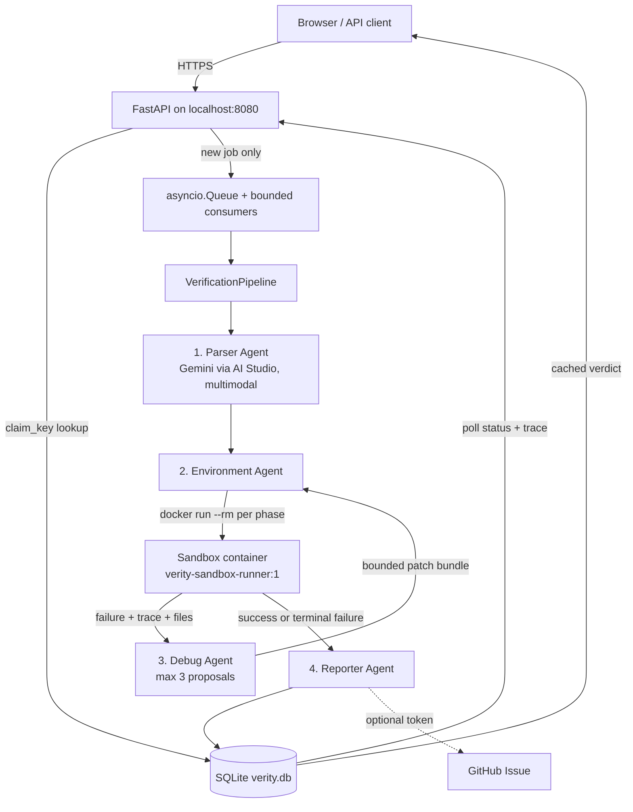
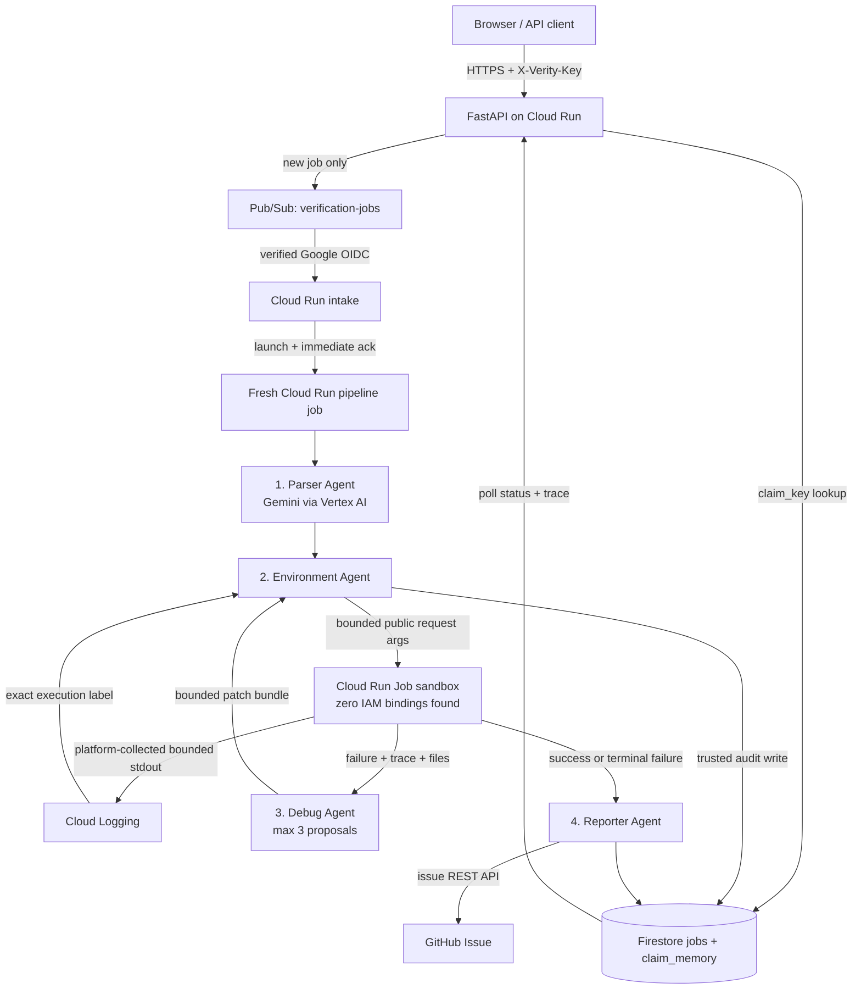

# Verity architecture

Verity's local infrastructure is implemented and exercised. The cloud adapter now has a
credential-free request/log-result handoff, a no-role sandbox identity policy, and a mandatory
metadata-token denial probe. Those controls are locally tested but have not run in the owner's
Google Cloud project, so cloud production and deployment remain fail-closed. `VERITY_ENV` still
selects adapters in one place, but the two profiles are not yet equally proven.

| Seam | Interface | `VERITY_ENV=local` | `VERITY_ENV=cloud` |
|---|---|---|---|
| State + trace + claim memory | `JobStore` | `SQLiteJobStore` (`verity.db`) | `FirestoreJobStore` |
| Intake → processing | `JobQueue` | `AsyncioJobQueue` | `PubSubJobQueue` |
| Model calls | `ModelClient` | `GeminiAIStudioClient` (API key) | `VertexAIModelClient` |
| Untrusted execution | `SandboxBackend` | `DockerSandboxBackend` | `CloudRunJobBackend` (experimental) |

The interfaces live in [`verity/interfaces.py`](../verity/interfaces.py) and the selection
lives in [`verity/container.py`](../verity/container.py) — the only module that imports a
concrete backend. No agent, no pipeline step, and no test touches SQLite, Docker,
Firestore, Pub/Sub, or Cloud Run directly.

## Local pipeline

## Cloud pipeline — implemented, awaiting live security proof

The typed contracts and three-attempt state machine are shared. The cloud sandbox does not import
a Google Cloud client, receive application secrets, or access Firestore. The trusted pipeline
persists both sides of the handoff. Deployment remains blocked until a real task obtains its
metadata token and proves that Firestore, Secret Manager, Pub/Sub, Cloud Run, Vertex AI, and Cloud
Storage all deny it. See [SCOPED-CLOUD-SECURITY-FIX.md](SCOPED-CLOUD-SECURITY-FIX.md).

## The sandbox

The Environment Agent executes arbitrary third-party code from GitHub. It never runs that
code on the host. Locally, each verification phase is its own `docker run --rm` against
[`Dockerfile.runner`](../Dockerfile.runner):

| Phase | Network | Rationale |
|---|---|---|
| clone | bridge | Fetch the declared repository. |
| venv | none | Create the interpreter; nothing to download. |
| install | bridge | Install the *declared* dependencies only. |
| evaluate | **none** | A benchmark that phones home while scoring is not reproducible. |

Every container gets `--cap-drop ALL`, `--security-opt no-new-privileges`, a read-only
root filesystem with a size-capped `/tmp` tmpfs, pid/memory/cpu limits, and exactly one
bind mount: a fresh host temp directory at `/work`. No Docker socket, no host paths, no
reuse between jobs. Patches are applied on the host inside that same temp directory, which
is why the mount is read-write rather than read-only.

`docker info` is checked before any verification job starts; a stopped daemon is reported
as a setup error rather than handed to the Debug Agent as something to patch. A fresh Cloud
Run task gives filesystem/process isolation between jobs and now uses a dedicated identity with
no project or discovered resource-level binding. It still does not reproduce the local
phase-specific network policy. A
no-role identity limits Google Cloud credential impact; it does not make arbitrary networked code
universally safe.

Isolation is not asserted, it is tested. [`tests/test_docker_sandbox.py`](../tests/test_docker_sandbox.py)
and [`scripts/validate_docker_isolation.py`](../scripts/validate_docker_isolation.py) start
real containers and try to read host files, write outside `/work`, reach the network during
evaluation, escalate privileges, find the Docker socket, and fork-bomb the daemon. Each one
must fail.

## Trust boundaries

- Intake accepts HTTPS only, rejects credential-bearing URLs, resolves every redirect
  target, and blocks private, loopback, reserved, and metadata IP addresses.
- Production currently refuses the Cloud Run sandbox until its no-role identity and API denials
  are observed live. `scripts/deploy.ps1` also stops before its first `gcloud` mutation.
- The sandbox request is bounded public-source data passed as execution arguments. The result is
  a bounded, run-ID-bound stdout envelope; only the trusted pipeline reads logs and Firestore.
- Pub/Sub verifies Google's token signature, issuer, configured audience, verified email claim,
  and exact push-service-account identity. No callback secret appears in the URL.
- Evaluation commands never run through a shell and are limited to Python/pip/pytest argv.
- Model patches are path-confined, size-bounded, exact-match edits. They cannot contain
  path traversal or modify anything outside the cloned repository.
- Source text, repository files, and error output are always framed as untrusted data in
  prompts, never as instructions.
- Three means three: the initial execution may be followed by at most three Debug Agent
  proposals and retries. Exhaustion produces `could_not_verify`, never a fabricated metric.
- `VERITY_SANDBOX_BACKEND=host_subprocess` exists for debugging Verity itself. It is not an
  isolation boundary, it logs a warning on selection, and production rejects it.

## Durable data model

The same four collections exist in both profiles — Firestore documents in the cloud, JSON
documents in four SQLite tables locally.

| Collection / table | Purpose |
|---|---|
| `jobs/{job_id}` | Current status, typed claim, terminal verdict |
| `jobs/{job_id}/trace/*` | Ordered agent transitions, errors, patches, outcomes |
| `claim_memory/{sha256(canonical_url)}` | Atomic dedup pointer and cached verdict |
| `sandbox_runs/{run_id}` | Trusted audit record of the sandbox request/result |

Reservation is transactional in both: `create_or_get` and `claim_job` use Firestore
transactions in the cloud and `BEGIN IMMEDIATE` locally, so two concurrent submissions of
one claim produce one job and one benchmark run. An at-least-once delivery that replays a
job id is rejected by `claim_job`, not re-executed.

## Known local-only limitations

- `AsyncioJobQueue` lives in one process. Jobs still queued when that process exits are not
  delivered. They stay visible in SQLite as `queued` rather than disappearing, and can be
  re-published safely, but the local queue is not a durable broker. Pub/Sub is.
- SQLite serialises writers behind one connection. Fine for a laptop and a demo; Firestore
  is what handles real concurrency.
- Cloud Trace and Cloud Logging are inactive locally; spans and structured logs go to
  stdout.
- Clone and install need bridge networking. Untrusted Python build hooks can therefore reach
  services visible from that network even though evaluation itself has no network.

## Remaining cloud requirements

- Run the mandatory stolen-metadata-token denial probe in the owner's real project and repeat it
  after IAM changes. The sandbox must retain zero effective access to sensitive Google APIs.
- Separate networked acquisition/build from offline evaluation or enforce equivalent egress
  controls, including metadata/private-address denial.
- Add job leases/recovery, payload offloading beyond Firestore's document limit, immutable
  source/image provenance, and a global deadline.
- Build both images and run cloud-specific isolation/integration tests before removing the
  production and deployment guards.

## Telemetry

Telemetry bootstrap exists in both the API and standalone worker: Cloud Trace spans wrap agent
invocations and Cloud Logging is configured for production. This wiring has not been observed
on a real cloud service, so it remains implemented but unverified. Detailed retry evidence is
also stored in the selected job store.
